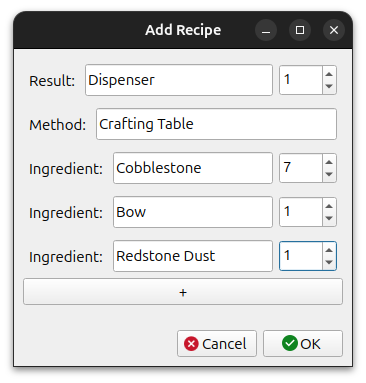
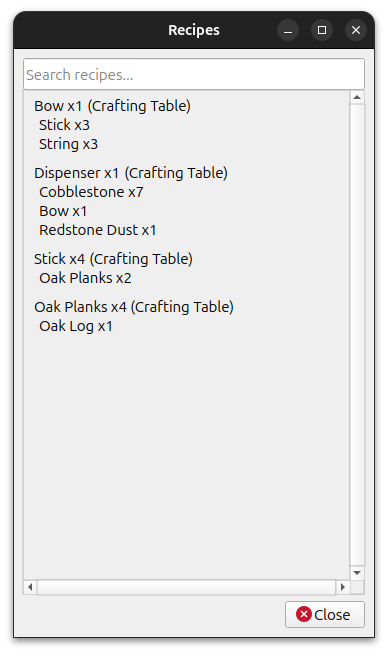
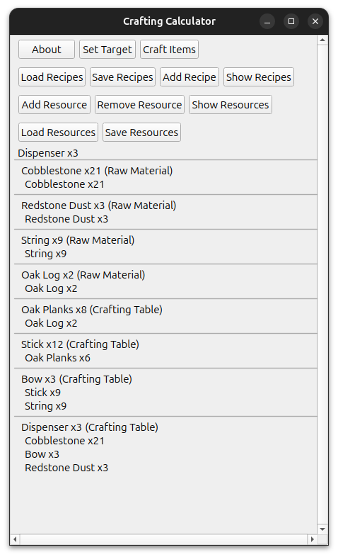
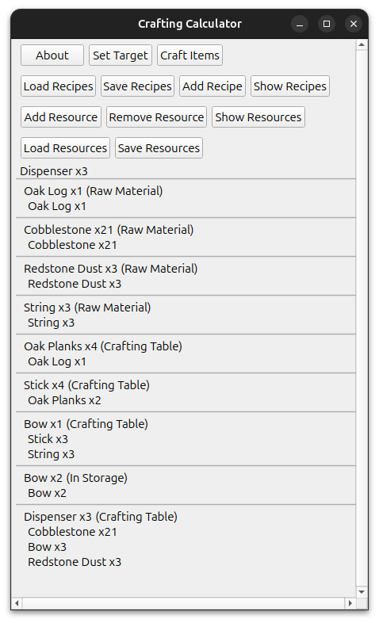

# crafting-calculator
A calculator for what resources are required to build something.

## Example images:

A recipe being defined: 

A list of recipes known to the calculator: 

The calculator showing the ingredients and steps to create three Dispensers: 

The same calculation as above except that two bows are already available and thus do not need to be crafted: 

